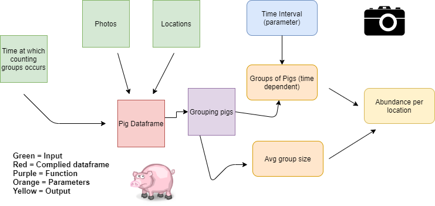

```{r setup, include=FALSE}
knitr::opts_chunk$set(echo = TRUE)
```

## Pig Modularity Diagram and Description


### Authors: Alex Milward, Shuhan Song, Nikole Vannest




**Link to Diagram**: https://drive.google.com/file/d/1DQvgzbSWCZw0bNeFlavT-QjiKF7_kizV/view?usp=sharing

**Background of Project**  
This project aims to use photos collected by camera trap stations to estimate the abundance of feral pigs in a closed populatin (e.g. a preserve, an island, a national park) to assist the monitoring of the invasive species. The GPS locations of camrea trap stations should be collected at the time of installation. This project can also be used for population studies on any wildlife species that are suitable for monitoring using camera trap stations (e.g. large carnivores that are easy to be detected by cameras). 

**Description of Diagram**  
As depicted in the image above, Time at which counting groups occurs, Photos, and Locations in green are all input data that gets compiled into Pig Dataframe in red. The Dataframe then, using a function, gets grouped in purple  and using Groups of Pigs (time dependent) and Average group which are  size as parameters, both in orange. The output, depicted in yellow, is data on the abundance and location of feral pigs from the original input.  

__*Pig Dataframe*__   
Input: camera trap photos, GPS locations of camera trap stations, time when photos were taken   
Output: a compiled dataframe of pig occurrences

__*Grouping pigs*__    
Input: a dataframe of pig occurrences compiled in the previous step    
Output: average group size at each camera trap stations, observed number of groups at each camera    
Parameters: Time interval to divide images of pigs into groups (e.g. successive photos taken less than 5.5 minutes will be grouped into one group)


